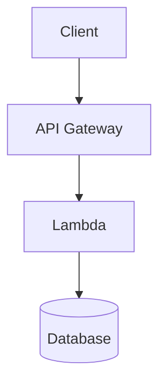

# Documentation Standards

Standards for creating, maintaining, and formatting all technical documentation in this project.

## 1. Documentation Principles

| Principle | Description |
|-----------|-------------|
| **Single Source of Truth** | Each fact documented in exactly one place. Cross-reference, don't duplicate. |
| **English Only** | All technical documentation in English (per `base-standards.md`). |
| **Living Documentation** | Docs updated with every code change. Outdated docs are worse than no docs. |
| **Audience Awareness** | Write for developers implementing features. Include context, not just reference. |
| **Structured Format** | Consistent structure per document type. Predictable navigation. |

## 2. Document Types and Structure

### 2.1 Standards Documents (`docs/*-standards.md`)

```markdown
---
description: One-line summary of what this document governs
alwaysApply: true  # or globs for specific file patterns
---

# Document Title

## 1. Overview
Brief purpose and scope.

## 2. Principles/Rules Table
| Rule | Description |
|------|-------------|

## 3. Detailed Sections
Numbered sections with clear headings.

## 4. Code Examples
Real, runnable examples with explanations.

## 5. Quick Reference
Condensed table for common operations.

## 6. Common Mistakes
What goes wrong + fixes.
```

### 2.2 API Specification (`docs/api-spec.yml`)

- **OpenAPI 3.0** format
- One file, organized by tags
- All endpoints, schemas, security schemes defined
- Examples for every request/response
- Updated with every endpoint change

### 2.3 Data Model (`docs/data-model.md`)

```markdown
# Data Model

## Entities
### EntityName
- Field: type — description, constraints
- Relationships: defined with cardinality

## ER Diagram
Mermaid diagram showing relationships.

## Validation Rules
Business rules not captured in schema.

## Migration Notes
Schema changes requiring data migration.
```

### 2.4 Architecture Decision Records (`docs/adr/NNN-title.md`)

```markdown
# ADR NNN: Title

## Status
Proposed | Accepted | Superseded

## Context
What decision needed to be made.

## Decision
What was decided.

## Consequences
Positive, negative, neutral outcomes.

## Alternatives Considered
Other options and why rejected.
```

### 2.5 README (`README.md`)

```markdown
# Project Name

One-line description.

## Quick Start
Minimal commands to run locally.

## Architecture
High-level diagram or description.

## Documentation Links
- [Standards](docs/base-standards.md)
- [API Spec](docs/api-spec.yml)
- [Data Model](docs/data-model.md)

## Development
Commands for dev, test, build, deploy.
```

### 2.6 Design System Documentation (`design-system/docs/`)

```markdown
# Component: Button

## Overview
Purpose, when to use, when not to use.

## Props Interface
| Prop | Type | Default | Description |
|------|------|---------|-------------|

## Variants
| Variant | Description |
|---------|-------------|

## States
| State | Visual | Implementation |
|-------|--------|----------------|

## Accessibility
- ARIA roles
- Keyboard behavior
- Focus management
- Screen reader announcements

## Examples
```tsx
<Button variant="primary" onClick={handleClick}>
  Submit
</Button>
```

## Token Dependencies
| Token | Usage |
|-------|-------|
```

### 2.7 Accessibility Documentation (`docs/accessibility.md`)

```markdown
# Accessibility Standards (WCAG 2.1 AA)

## Checklist
- [ ] 1.1.1 Non-text Content
- [ ] 1.3.1 Info and Relationships
- [ ] 1.4.3 Contrast (Minimum)
- [ ] 2.1.1 Keyboard
- [ ] 2.4.7 Focus Visible
- [ ] 3.3.2 Labels or Instructions
- [ ] 4.1.2 Name, Role, Value

## Implementation Patterns
- Semantic HTML
- Form accessibility
- Focus management
- Live regions

## Testing Procedures
- Automated: jest-axe, Lighthouse
- Manual: Keyboard, NVDA, VoiceOver
```

### 2.8 Performance Budget Documentation (`docs/performance-budget.md`)

```markdown
# Performance Budgets

## Core Web Vitals
| Metric | Budget | Tool |
|--------|--------|------|
| LCP | ≤ 2.5s | Lighthouse CI |
| INP | ≤ 200ms | Lighthouse CI |
| CLS | ≤ 0.1 | Lighthouse CI |

## Bundle Budgets
| Asset | Budget | Tool |
|-------|--------|------|
| Main JS (gz) | ≤ 170 KB | bundlesize |
| Vendor JS (gz) | ≤ 100 KB | bundlesize |
| CSS (gz) | ≤ 50 KB | bundlesize |

## Optimization Patterns
- Code splitting
- Image optimization
- Font loading
- Third-party management
```

### 2.9 Analytics Tracking Plan (`docs/analytics-tracking-plan.md`)

```markdown
# Analytics Tracking Plan

## Events
| Event | Trigger | Properties | Funnel Stage |
|-------|---------|------------|--------------|

## User Properties
| Property | Source | Updated |
|----------|--------|---------|

## Funnels
### Hiring Funnel
`candidate_created` → `interview_scheduled` → `offer_sent` → `offer_accepted`

## Dashboards
| Dashboard | Audience | Refresh |
|-----------|----------|---------|
```

### 2.10 UX Documentation (`docs/ux/`)

```markdown
# User Personas / Journeys / Design Principles

## Persona: Hiring Manager
- Demographics
- Goals
- Pain points
- Current workflow

## Journey: Create Job Posting
Current state → Future state (with feature)

## Design Principles
1. Clarity over cleverness
2. Consistency over customization
3. Accessibility by default
```

## 3. Formatting Standards

### 3.1 Markdown

- **Headings**: ATX style (`#`, `##`, `###`). No Setext (`===`, `---`).
- **Code blocks**: Always specify language (` ```typescript`).
- **Tables**: Use for structured data. Align pipes for readability.
- **Lists**: Use `-` for unordered, `1.` for ordered. No `*`.
- **Links**: Relative paths for internal docs. Absolute for external.
- **Emphasis**: `**bold**` for emphasis, ` `code` ` for inline code.

### 3.2 Code Examples

- **Complete and runnable** — not fragments
- **Realistic data** — not `foo`, `bar`, `test`
- **Commented** — explain WHY, not WHAT
- **Consistent style** — match project conventions (2-space indent, semicolons, etc.)

### 3.3 Mermaid Diagrams



Use for: Architecture, data flow, state machines, ER diagrams, user journeys.

## 4. Maintenance Workflow

### 4.1 When to Update Docs

| Trigger | Docs to Update |
|---------|----------------|
| New/modified endpoint | `api-spec.yml`, relevant standards doc |
| New/modified entity | `data-model.md`, `api-spec.yml` schemas |
| New validation rule | `backend-standards.md`, `api-spec.yml` |
| New component pattern | `frontend-standards.md` |
| New testing pattern | `backend-standards.md` or `frontend-standards.md` |
| New env variable | `backend-standards.md`, `.env.example` |
| Architecture change | `base-standards.md`, relevant layer standards |
| New ADR | `docs/adr/NNN-title.md` |
| **New DS component/token** | `design-system/docs/`, `frontend-standards.md` |
| **Accessibility pattern** | `docs/accessibility.md`, `frontend-standards.md` |
| **Performance budget change** | `docs/performance-budget.md`, `frontend-standards.md` |
| **Analytics event/funnel** | `docs/analytics-tracking-plan.md`, `frontend-standards.md` |
| **UX flow/persona change** | `docs/ux/`, `README.md` |

### 4.2 Update Process

1. **Identify** affected docs from change (use `update-docs` skill)
2. **Edit** each doc per formatting standards
3. **Verify** consistency:
   - API spec matches implementation
   - Data model matches Prisma schema
   - Design System tokens match implementation
   - Examples still run
4. **Commit** doc changes with implementation (same PR)

### 4.3 Review Checklist

- [ ] English only
- [ ] No duplicate content (cross-reference instead)
- [ ] Code examples compile/run
- [ ] Links resolve (internal and external)
- [ ] Tables aligned and readable
- [ ] Mermaid diagrams render
- [ ] Version/date updated if applicable

## 5. AI Spec Standards

For OpenSpec artifacts in `openspec/`:

### 5.1 Spec Documents (`openspec/specs/*/spec.md`)

```markdown
# Capability: Name

## Purpose
What this capability does and why it exists.

## Requirements

### Requirement: Short Name
The system SHALL...

#### Scenario: Descriptive Name
- **WHEN** [condition]
- **THEN** [expected outcome]
```

### 5.2 Scenarios

- **Gherkin-style**: WHEN/THEN format
- **Atomic**: One behavior per scenario
- **Testable**: Clear pass/fail criteria
- **Negative cases**: Include error/invalid scenarios
- **UX scenarios**: Usability, accessibility, performance
- **Analytics scenarios**: Event firing, property validation

### 5.3 Tasks (`openspec/changes/*/tasks.md`)

```markdown
# Tasks for Change: Name

## Phase 1: UX & Design
- [ ] UX Research complete (REF: UX-001)
- [ ] Prototype usability test (REF: UX-002)
- [ ] Design System alignment (REF: DS-001)
- [ ] Accessibility spec (REF: A11Y-001)
- [ ] Performance budgets (REF: PERF-001)
- [ ] Analytics tracking plan (REF: AN-001)

## Phase 2: Backend Implementation
- [ ] Write failing tests (REF: REQ-X)
- [ ] Implement minimal code
- [ ] Refactor

## Phase 3: Frontend Implementation (DS-First)
- [ ] Map to DS components (REF: FE-001)
- [ ] Implement with a11y (REF: A11Y-002)
- [ ] Performance optimization (REF: PERF-002)
- [ ] Analytics integration (REF: AN-002)

## Phase 4: Integration & Verification
- [ ] All tests pass
- [ ] Lighthouse CI budgets pass
- [ ] Bundle size check
- [ ] Accessibility audit
- [ ] Analytics validation
- [ ] Design QA

## Phase 5: Documentation & Spec Sync
- [ ] Update API spec
- [ ] Update data model
- [ ] Sync OpenSpec artifacts
- [ ] Update standards docs
- [ ] Update DS/UX/Analytics docs

## Phase 6: Pre-Archive Validation
- [ ] Adversarial review
- [ ] Spec + UX demo
- [ ] Commit & PR
```

- Checkboxes for tracking
- Grouped by logical phases
- Each task small enough for single commit
- Reference spec requirements (REF: REQ-X)

## 6. Quality Gates

Every documentation change must satisfy:

- [ ] Follows structure for its document type
- [ ] English only
- [ ] No duplicate content
- [ ] Code examples verified
- [ ] Internal links resolve
- [ ] Consistent formatting
- [ ] Cross-references accurate