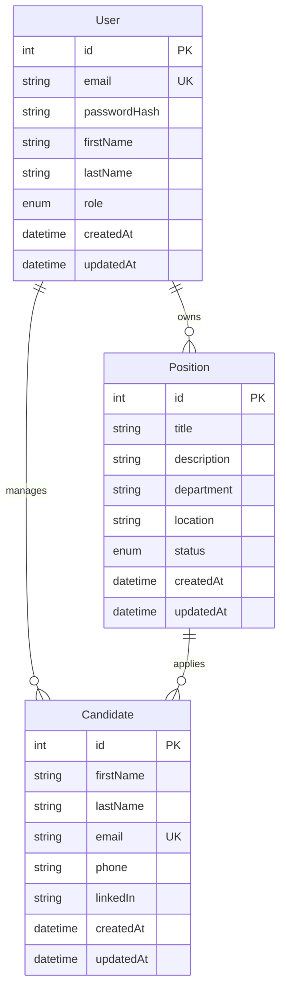

# Data Model

## Entities

### User
- id: number — Primary key, auto-increment
- email: string — Unique, email format
- passwordHash: string — Bcrypt hash
- firstName: string — Max 100 chars
- lastName: string — Max 100 chars
- role: enum — ADMIN | USER | MANAGER
- createdAt: DateTime — Auto-set on create
- updatedAt: DateTime — Auto-updated

### Candidate
- id: number — Primary key, auto-increment
- firstName: string — Max 100 chars
- lastName: string — Max 100 chars
- email: string — Unique, email format
- phone: string? — Optional, phone format
- linkedIn: string? — Optional, URL format
- createdAt: DateTime — Auto-set on create
- updatedAt: DateTime — Auto-updated

### Position
- id: number — Primary key, auto-increment
- title: string — Max 200 chars
- description: string — Text
- department: string — Max 100 chars
- location: string — Max 100 chars
- status: enum — OPEN | CLOSED | ON_HOLD
- createdAt: DateTime — Auto-set on create
- updatedAt: DateTime — Auto-updated

## Relationships

## Validation Rules

- Email must be unique across all users and candidates
- Password must be hashed with bcrypt (cost factor 12)
- Position title must be unique per department
- Candidate email must be unique
- Soft delete preferred over hard delete (add `deletedAt` field if needed)

## Migration Notes

- All tables use `createdAt` and `updatedAt` timestamps
- Use Prisma migrations for all schema changes
- Seed data via `prisma/seed.ts`